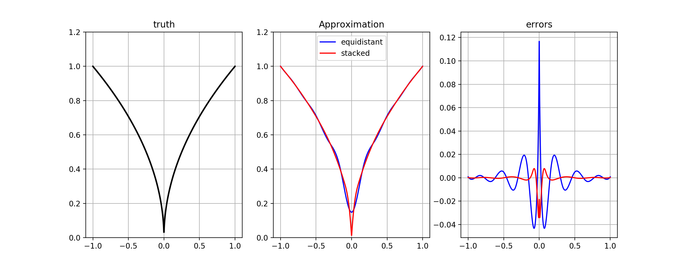

# ApproXD

[](https://travis-ci.org/floswald/ApproXD.jl)
[](https://codecov.io/gh/floswald/ApproXD.jl)


* This package implements bspline and linear interpolation in julia
* For most purposes, [Interpolations.jl](https://github.com/JuliaMath/Interpolations.jl) will be preferrable to this package.
* However, there are some features which are available here, and not there.
    - the method `getTensorCoef` is a very efficient algorithm to compute approximating coefficients from a tensor product of basis matrices. it is efficient because it never forms the tensor product.
    - the package allows low-level access to objects such as spline knot vectors. Suppose you want to have a knot vector with a [knot multiplicity](https://pages.mtu.edu/~shene/COURSES/cs3621/NOTES/spline/B-spline/bspline-mod-knot.html) in the interior knot span to approximate a kink. For example,
    ```julia
    knots = vcat(lb,-0.5,0,0,0.5,ub)
    ```
    is a valid knot vector.
* Documentation is non-existent. Please look at the tests. Sorry.

## Example

```julia
using ApproXD
f(x) = abs.(x).^0.5
lb,ub = (-1.0,1.0)
nknots = 13
deg = 3

# standard case: equally spaced knots
params1 = BSpline(nknots,deg,lb,ub)   
nevals = 5 * params1.numKnots # get nBasis < nEvalpoints

# myknots with knot multiplicity at 0
myknots = vcat(range(-1,stop = -0.1,length = 5),0,0,0,  range(0.1,stop = 1,length =5))
params2 = BSpline(myknots,deg)  # 0: no derivative

# get coefficients for each case
eval_points = collect(range(lb,stop = ub,length = nevals))  
c1 = getBasis(eval_points,params1) \ f(eval_points)
c2 = getBasis(eval_points,params2) \ f(eval_points)

# look at errors over entire interval
test_points = collect(range(lb,stop = ub,length = 1000));
truth = f(test_points);
p1 = getBasis(test_points,params1) * c1;
p2 = getBasis(test_points,params2) * c2;
e1 = p1 - truth;
e2 = p2 - truth;
```


